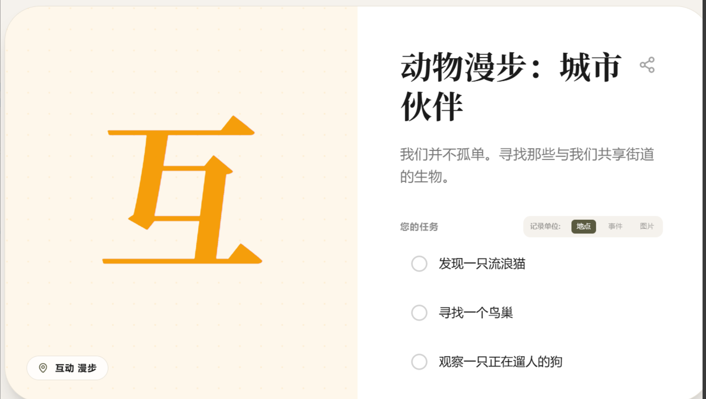
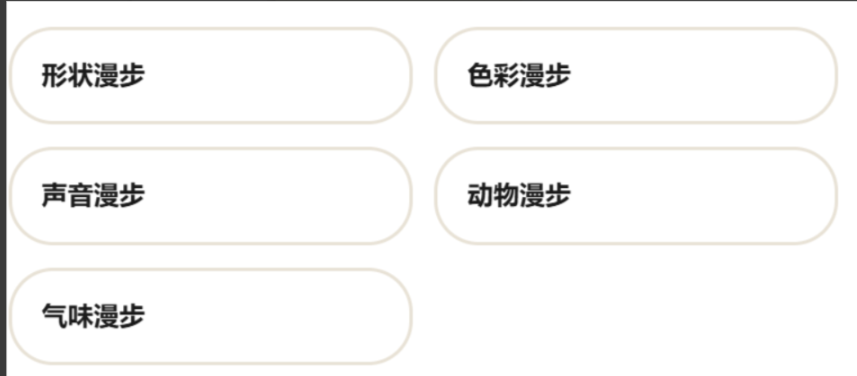
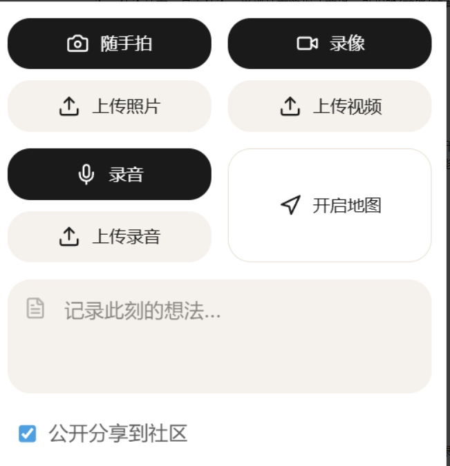

功能架构：
## 探索页：
一、页头：模式切换栏（纯粹/进阶）＋地址搜索栏

（prompt:根据用户选定位置三公里内位置信息生成具体任务，减少幻觉）
二、纯粹模式
1.展示栏（AI生成纯色底色和单个字）＋任务栏（主题＋一个简单任务）

2.两个功能：随机/选择

随机：主题从形状、色彩、声音、动物、气味漫步中随机一个，并根据定位三公里范围内信息生成一个简单任务（e.g.色彩漫步：寻找红色的事物）
选择：用户从形状、色彩、声音、动物、气味漫步中选择1-2个作为主题

3.任务打卡：点击任务，出现打卡选项（选填，可拍照/录像/录音），用户也可以直接勾选完成

4.记录与追踪模块：文字、照片、录像、录音多种选填，按按钮"开启地图"开始追踪，展示栏变为地图界面，再按一次按钮停止追踪，展示栏恢复。（社区功能先去掉）

5.一次漫步完成后根据漫步内容ai生成一张卡片，保存在足迹，如果触发成就条件则达成成就
三、进阶模式
1.四个选项：天气（晴朗、多云、雨天、大风）；季节（春夏秋冬）；状态（发呆、元气满满、忧郁、愉悦、未知）；偏好（自然景观、人文历史、市井烟火）
2.展示栏（AI生成纯色底色和单个字）＋任务栏（主题＋三个稍微复杂任务）
3.AI生成按钮（根据选项与周边环境随机生成主题与任务）
4.任务打卡
5.记录与追踪
6.一次漫步完成后根据漫步内容ai生成一张卡片，保存在足迹，如果触发成就条件则达成成就

## 足迹页：
分为“纪念卡册”与“成就”两个模块，先留空
